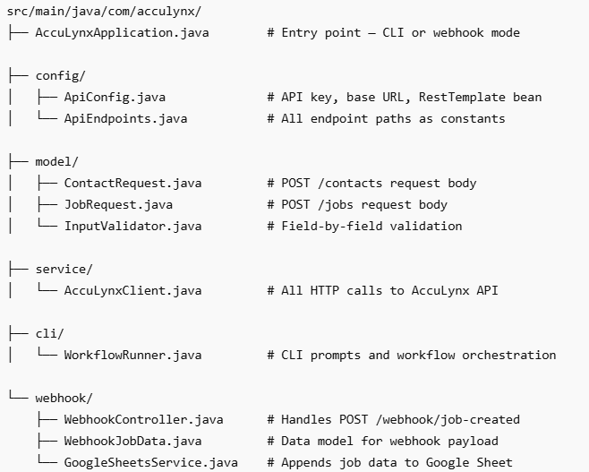
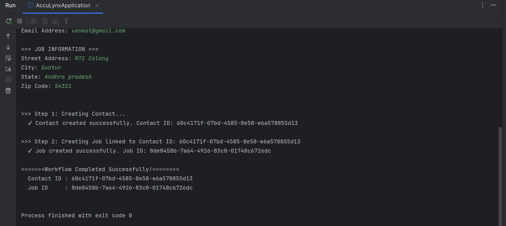
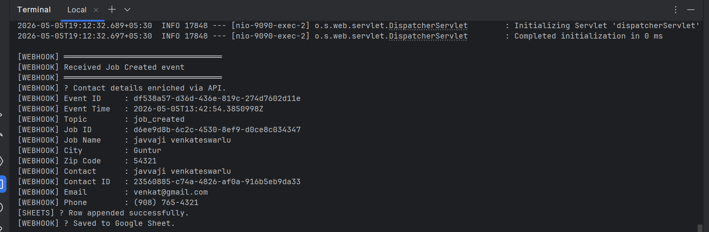
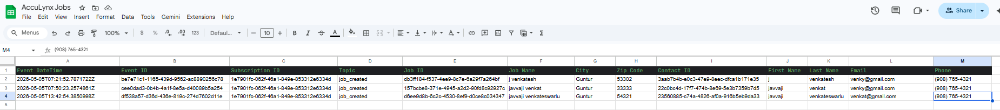

# AccuLynx REST API Integration
**Language:** Java 17 | **Framework:** Spring Boot 3

---

## What This Does

A CLI tool that:
1. Collects user input (Contact + Job details) via terminal
2. Creates a **Contact** in AccuLynx via REST API
3. Uses the returned Contact ID to create a **Job** linked to it
4. **(Bonus)** Listens for `job_created` webhook events, enriches contact data via API, and saves to Google Sheets

---

## Project Structure



---

## Prerequisites

- Java 17+
- Maven 3.8+
- ngrok (for webhook mode)
- Google Cloud service account with Sheets API enabled (for bonus)

---

## Setup

### 1. Environment Variables

Create a `.env` file in the project root (use `.env.example` as template):

BASE_URL=https://api.acculynx.com/api/v2

API_KEY=your_acculynx_api_key_here

### 2. Google Sheets (Bonus only)
- Create a Google Cloud service account
- Enable Google Sheets API
- Download the JSON key and place at:
  `src/main/resources/google-credentials.json`
- Share your Google Sheet with the service account email (Editor access)

---

## Build

```bash
mvn clean package -DskipTests
```

---

## Run: CLI Mode (Create Contact + Job)

```bash
java -jar target/acculynx-integration.jar
```

### Sample Input


=== CONTACT INFORMATION ===

First Name: javvaji

Last Name: venkateswarlu

Phone Number: 9087654321

Email Address: venkat@gmail.com

=== JOB INFORMATION ===

Street Address: RTC Colony

City: Guntur

State: Andhra pradesh

Zip Code: 54321

### Actual Console Output


---

## Run: Webhook Mode (Bonus)

### Step 1 — Start webhook server
```bash
java -jar target/acculynx-integration.jar --webhook
```
Server starts on `http://localhost:9090`

### Step 2 — Expose publicly via ngrok
```bash
ngrok http 9090
```
Copy the HTTPS URL e.g. `https://abc123.ngrok-free.app`

### Step 3 — Register webhook subscription (PowerShell)
```powershell
Invoke-RestMethod -Uri "https://api.acculynx.com/webhooks/v2/subscriptions" `
  -Method POST `
  -Headers @{
    "Authorization" = "Bearer YOUR_API_KEY"
    "Content-Type"  = "application/json"
  } `
  -Body '{
    "consumerUrl": "https://YOUR_NGROK_URL/webhooks/job-created",
    "techContact": "your@email.com",
    "topicNames": ["job_created"],
    "integrationType": "Api"
  }'
```

### Step 4 — Trigger a job (run CLI in second terminal)
```bash
java -jar target/acculynx-integration.jar
```

### Actual Webhook Console Output



---
## Google Sheets Integration (Bonus)

Each `job_created` event automatically appends a row:



---
## Running Locally (All Three Terminals Required)

To test the full webhook flow, you need three terminals running simultaneously:

### Terminal 1 — Start ngrok
```bash
ngrok http 9090
```
Copy the HTTPS forwarding URL e.g. `https://abc123.ngrok-free.app`

### Terminal 2 — Start Webhook Server
```bash
java -jar target/acculynx-integration.jar --webhook
```
Server starts on `http://localhost:9090` and waits for incoming events.

### Terminal 3 — Run CLI to Trigger Job Creation
```bash
java -jar target/acculynx-integration.jar
```
This creates a Contact + Job via AccuLynx API.
AccuLynx then fires a `job_created` webhook to your ngrok URL,
which Terminal 2 receives and saves to Google Sheets.

### Flow
```
CLI creates Job
      ↓
AccuLynx fires webhook → ngrok → localhost:9090
      ↓
WebhookController parses payload
      ↓
Enriches contact email + phone via API
      ↓
Saves row to Google Sheets
```
---
## Key Design Decisions

| Decision | Reason |
|----------|--------|
| Validate field by field | Better UX — fix mistake immediately |
| Base URL in `.env`, paths in `ApiEndpoints.java` | Nothing hardcoded in service classes |
| `contact: { id }` as nested object in JobRequest | AccuLynx API requires object, not flat string |
| `contactTypeIds` as UUID string | API enforces at least one item |
| Webhook always returns 200 OK | Prevents AccuLynx from retrying endlessly |
| Email/phone fetched via sub-resource API | Not included in webhook payload — enriched separately |
| CLI mode disables web server | Avoids port conflict when running both modes |

---

## Error Handling

| Scenario | Behavior |
|----------|----------|
| Empty or invalid field | Re-prompts with specific error message |
| 400 Bad Request | Shows field-level error from AccuLynx response |
| 401 Unauthorized | Shows API key invalid message |
| Webhook parse error | Logs error, still returns 200 OK |
| Contact enrichment failure | Logs warning, webhook still saves to Sheet |
| Google Sheets write failure | Logs warning, does not block webhook processing |

---

## Evidence

See `/evidence_outputs` folder:
- `01_contactId_jobId_created.png` — CLI execution
- `02_webhook_received.png` — webhook server logs
- `03_google_sheet.png` — populated Google Sheet
- `04_Handling_input.png` — validation of input
- `05_valid_input.png` — Sample input
- `06_output_console.txt` - console output